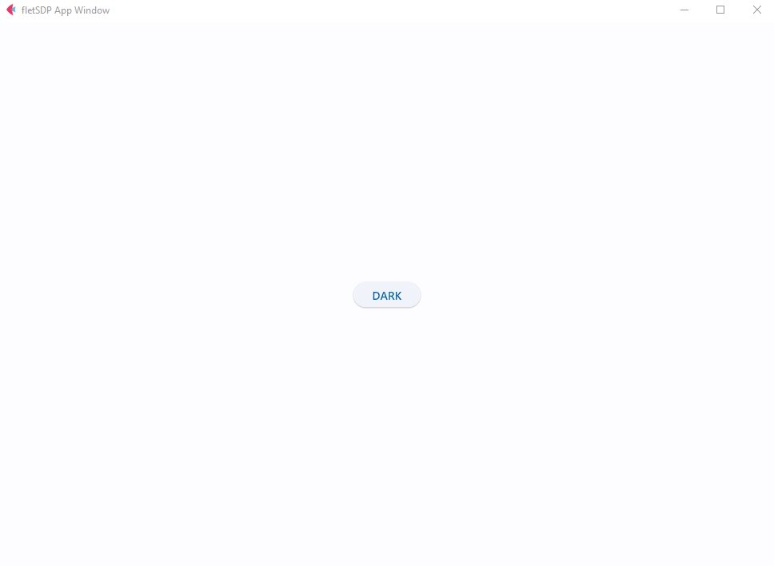

# Flet Software Development Pattern (fletSDP)
This module aims to facilitate writing Flet software in a structured way.
## Feature Highlights

* Multiple views in seperated script
* Writing your project in object oriented way
* Flexible and simple module structure; easy to use.



# How to Use

## Installation
Install from GitHub:

```
pip install git+https://github.com/ipritom/fletSDP
```
* Should have [Git](https://git-scm.com/) installed on your system.
## Tutorial
Check an example in the `examples` directory. 
This module will help you to write flet based software with separation of concern. 

### Basic Structure
Write a view in the following way. The code will be in the seperate view script file. For example: viewexample.py
```python
import flet as ft
from fletSDP.views import FletView

class ViewExample(FletView):
    def __init__(self, page: ft.Page, updater) -> None:
        super().__init__(page, updater)

    def controls(self):
        # declare all the controls related to this view
        # specially, controls with external/complex functions

    def layout(self):
        # write the layout code under this method
        
```

Write the main app script in the following way. This can be names as `app.py`

```python
import flet as ft
from fletSDP.app import FletApp

from viewexample import ViewExample

class App(FletSDPApp):
    
    def __init__(self, title=None) -> None:
        super().__init__(title)

    def views(self, page:ft.Page):
        # create the object of the view here
        self.view_example = ViewExample(self.page, updater=self.control_updater_func) 
    
    
    def control_updater_func(self):
        # update controls in a View class in the App class

    def app_presentaion(self):
        # app presentation Logic under this method 
        self.view_example.render()
        
       
    # write other app logics here
    
        
# creating app object and running the app
app = App()
app.run()
```
Now after completing the codebase in this way you can execute it by running `app.py` script.
